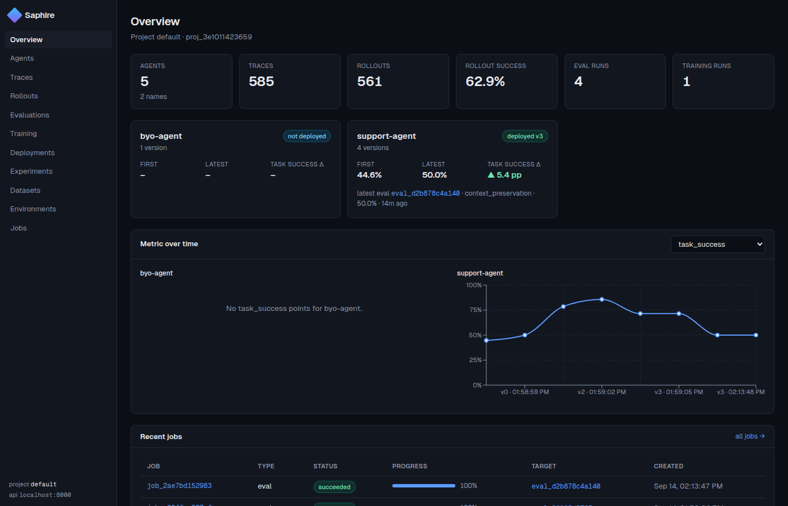
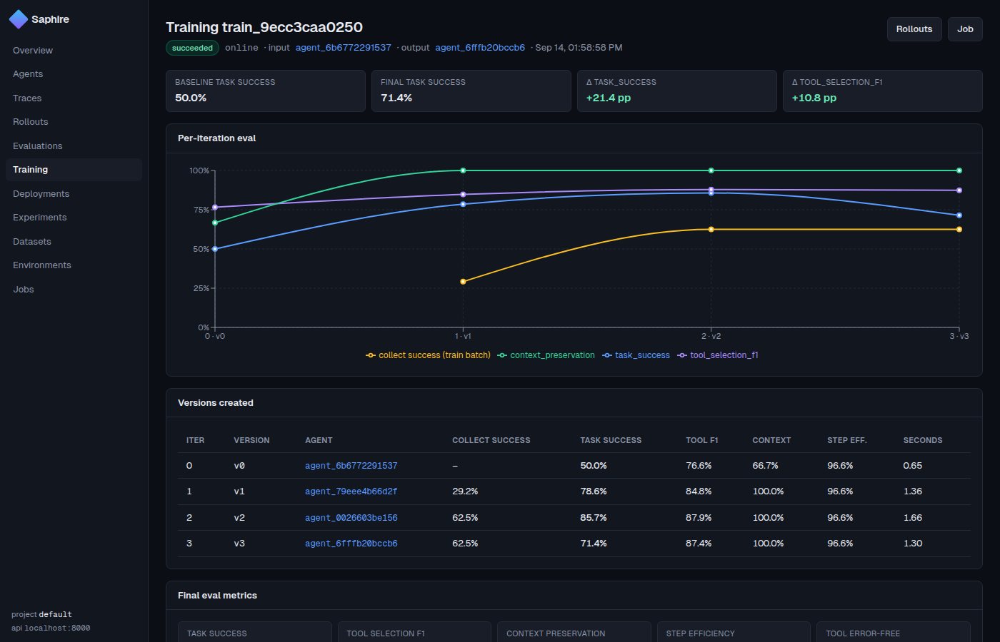

# Saphire

**Saphire turns a company's first-party data, tools and environments into a continuously learning agent stack.**

It is an open, self-hostable platform that covers the whole loop:

```
   your data / tools / environments
              │
              ▼
   ┌──────────────────┐   traces, rollouts, rewards   ┌──────────────────────┐
   │  Instrumented    │ ────────────────────────────▶ │  Saphire server      │
   │  agent (SDK)     │ ◀──────────────────────────── │  (API + workers + UI)│
   └──────────────────┘   new agent versions           └──────────────────────┘
        ▲                                                   │
        │   1. LEARN    verifiers · LLM judges · human scores → training signals
        │   2. IMPROVE  tool router · exemplars · prompt optimisation (online)
        │               SFT · DPO · GRPO with environment-grounded rewards (offline, TRL)
        │   3. VALIDATE tool selection · context preservation · long-horizon workflows,
        │               pass@k / pass^k reliability, throughput, deployment gates, A/B experiments
        └── 4. MEASURE  reliability, throughput and improvement over time, per version
```

It matches the publicly described capabilities of Metis "Insight/Mantis" (OpenTelemetry tracing SDK, training/eval
framework, GEPA-style prompt optimisation, A/B experiments, agent manifests) and adds pieces that are only *claimed*
there: environment-grounded reward generation, an online learning loop with versioned artifacts, reliability
metrics (pass^k), statistical deployment gates and a full dashboard. See [docs/METIS_COMPARISON.md](docs/METIS_COMPARISON.md)
for the verified feature-by-feature comparison and the honest list of gaps.

---

## Quick start (5 minutes, no GPU, no API keys)

```bash
git clone https://github.com/Garbanzo87/Saphire && cd Saphire
python -m venv .venv && source .venv/bin/activate
pip install -e ".[dev]"

# 1. run the API with jobs executed in-process (dev mode)
saphire serve --inline-jobs &            # http://localhost:8000/docs

# 2. populate it with the end-to-end demo:
#    agent -> baseline eval (k=2, judge) -> 5 online-learning iterations -> gated deployment -> A/B experiment
saphire demo

# 3. dashboard
cd frontend && npm install && npm run dev   # http://localhost:3000
```

The demo uses the deterministic **mock policy** (a scripted, weak tool-using agent) so everything runs offline in
~30 s. Typical output: held-out task success **0.45 → 0.9+** over five iterations, driven by the learned tool router,
retrieved exemplars and reflective prompt optimisation. Swap `--model mock:error=0.3` for `openai/gpt-4o-mini`,
`anthropic/claude-sonnet-4-20250514`, `ollama/llama3.1`, or `hf:./checkpoints/sft/final` to run real models.

Or with Docker (Postgres + API + worker + dashboard):

```bash
docker compose up --build
docker compose exec api saphire demo --host http://api:8000
```





---

## What's inside

| Layer | Package | What it does |
|---|---|---|
| **SDK** | `saphire.sdk` | OpenTelemetry tracing (`tracing.init/span/trace/tool`), `ToolRegistry` (Python functions → JSON-schema tools; MCP adapter), LLM providers (LiteLLM, local HF checkpoints, deterministic mock), the generic `ToolAgent` loop with simulated multi-turn users, `RolloutRecorder` for bring-your-own agents, learnable `ToolRouter`, `ExemplarStore`, `SaphireClient`. |
| **Environments** | `saphire.environments` | `Environment` abstraction (tools + per-rollout world state + task generator + simulated user + verifier). Built-ins: `support_desk` (30 tools, 7 task families incl. multi-turn and 6-step workflows) and `data_ops`. |
| **Connectors** | `saphire.connectors` | Build environments from **your** systems: `SQLConnector` (any SQLAlchemy DB), `OpenAPIConnector` (REST specs), `FileDataConnector` (CSV/JSON exports → safe simulated copies), MCP servers, `DataEnvironment` + generic `TaskVerifier`. |
| **Signals** | `saphire.signals` | Rollouts + rewards → datasets: router examples, SFT pairs, DPO preference pairs, GRPO prompts with replayable prefixes, step-reward tables. Rubric **LLM-as-judge** (boolean checks over trace evidence), pairwise judge, trainable **reward model** (`rm:` judge) and judge **calibration** against human labels. |
| **Training** | `saphire.training` | `OnlineLoop` (collect → verify → update → evaluate, versioned artifacts), router/exemplar learners, GEPA-style reflective `optimize_prompt`, TRL trainers `sft` / `dpo` / `grpo` (GRPO reward = replay the action in the environment). |
| **Evaluation** | `saphire.evaluation` | Runner with concurrency, `k` trials, pass@k / pass^k / consistency, latency percentiles, throughput, tokens; suites (`tool_selection`, `context_preservation`, `long_horizon`, `cross_env`, `full`); bootstrap CIs, permutation tests, `GatePolicy` deployment gates. |
| **Server** | `saphire.server` | FastAPI + SQLAlchemy (SQLite dev / Postgres prod), DB-backed job queue with `saphire worker`, REST API for projects, agents (versions, promote), datasets, traces/spans ingest, rollouts, scores, evals, training runs, deployments, A/B experiments, metrics time series. |
| **Dashboard** | `frontend/` | Next.js 14 + Tailwind + Recharts: overview with improvement-over-time charts, agents, trace waterfall, rollouts/conversations, evals (+compare, blame), training runs (+iteration charts), deployments/gates, experiments, jobs, intelligence, attribution, signals (calibration / tool stats), webhooks, org, audit. |
| **Multi-agent** | `saphire.sdk.multi_agent`, `saphire.training.multi_agent` | Orchestrator + specialist roles with hand-off tools, per-role steps/credit assignment, **selective optimisation** (`optimize_roles`) that trains chosen roles and freezes the rest, joint multi-role prompt optimisation. |
| **Distributed** | `saphire.distributed` | Ray / process / thread rollout engine for collection and evaluation, environment & reward server for remote trainers, verl dataset export + reward function, OpenRLHF agent loop. |
| **Enterprise** | `saphire.server.auth`, `routers/admin.py`, `routers/scim.py` | Organizations, hashed org API keys (IP allowlists), OIDC SSO + JWT sessions, SCIM 2.0 provisioning, RBAC (viewer/member/admin/owner), audit log, usage metering, plans/quotas, rate limits, HMAC-signed webhooks, Prometheus `/metrics`, Alembic migrations, retention. |
| **Intelligence** | `saphire.intelligence`, `saphire.sdk.attribution` | Production drift detection, failure clustering, eval-coverage gaps, task mining from real traffic, prioritised recommendations with one-click apply; multi-agent attribution (blame, advantage credit, role ablation, Shapley). |
| **Ops** | `Dockerfile`, `docker-compose.yml`, `deploy/helm`, `deploy/k8s`, `.github/workflows/ci.yml` | Containers, compose stack, Helm chart (HPA, KEDA worker autoscaling, retention CronJob, env server), S3 artifact store, benchmark harness (`saphire bench`), CI. |

---

## Core concepts

* **Rollout** – one attempt of an agent at a **TaskSpec** inside an **Environment**; a list of **Steps**
  (prompt state → assistant action → tool results) plus **Rewards** with provenance (`verifier`, `judge:<model>`, `human`, …).
  Rollouts are the unit for evaluation *and* the unit training signals are generated from.
* **Environment** – tools + a fresh, isolated copy of world state per rollout + a verifier that scores the *final state*
  (not just the transcript). The verifier emits trajectory-level rewards (`task_success`, `tool_selection_f1`,
  `context_preservation`, `step_efficiency`, `tool_error_free`) and step-level `tool_correct` signals for RL.
* **Agent version** – an `AgentConfig` (model, system prompt, router artifact, exemplar store, top-k) stored in the
  server. Training runs create new versions; evaluations and gates decide which is `deployed`.
* **Job** – evaluations and training runs execute asynchronously on workers (`saphire worker`) or inline.

## Learning mechanisms (all run on CPU, real weight updates optional)

| Mechanism | Updates | Signal | Where |
|---|---|---|---|
| Tool router | hashed n-gram logistic head ranking the tool catalogue; only top-k exposed | `tool_correct` step rewards ± successful trajectories | `training/learners.py`, `sdk/router.py` |
| Exemplar store | retrieval of successful (instruction → tool sequence) demonstrations into the prompt | high-reward rollouts | `sdk/exemplars.py` |
| Prompt optimisation | GEPA-style reflect-on-failures → rewrite → Pareto pool | verifier rationales | `training/prompt_opt.py` |
| SFT | model weights (TRL, LoRA optional) | successful trajectories, completion-only loss | `training/trl_trainers.py` |
| DPO | model weights | (chosen, rejected) actions from good vs bad rollouts on the same task | idem |
| GRPO | model weights | environment-grounded reward: replay prefix, execute sampled action, score | idem |
| Online loop | all of the above on a schedule, versioned | everything | `training/online.py` |

## Evaluation dimensions

* **Tool selection** – set F1 vs expected tools, order checks, distractor catalogue (16 look-alike tools), no-harmful-side-effect checks.
* **Context preservation** – multi-turn tasks where an identifier from turn 1 must be reused in turn 3; cross-step argument passing from tool outputs; `MockLLM(context_window=N)` simulates context loss for regression tests.
* **Long, multi-step workflows** – 6-step ordered workflows verified from final state (ticket created *and* escalated, refund amount, email sent).
* **Reliability** – pass@1, pass^k (all k trials succeed, τ-bench estimator), consistency, tool error rate, bootstrap CIs.
* **Throughput** – tasks/min at a given concurrency, latency p50/p95, tokens/task.
* **Improvement over time** – every eval writes metric points per agent version; the dashboard and `/v1/metrics/timeseries` chart them.
* **Deployment gates** – absolute thresholds + non-regression vs the deployed baseline with permutation-test p-values; `auto_promote` on pass.
* **Online A/B** – sticky variant assignment for live traffic, outcome ingestion, CI + p-value.

---

## Using it with your own agent and data

```python
from saphire.sdk import tracing, ToolAgent, AgentConfig, SaphireClient
from saphire.connectors import SQLConnector, DataEnvironment
from saphire.sdk.types import TaskSpec

tracing.init(service_name="crm-agent")                      # spans -> Saphire
reg = SQLConnector("postgresql://.../crm", tables=["customers", "orders"]).registry()
env = DataEnvironment("crm", reg, tasks=[TaskSpec(env_name="crm", instruction="...", expected={"tools": ["get_orders"]})])
agent = ToolAgent(AgentConfig(name="crm-agent", model="openai/gpt-4o-mini", router_top_k=10))

from saphire.evaluation.runner import evaluate
res = evaluate(agent, env.generate_tasks(), envs={"crm": env}, k=3)
print(res.metrics["pass_hat_3"], res.metrics["tool_selection_f1"])
```

* Already have an agent (LangGraph, OpenAI Agents SDK, custom)? Record it with `RolloutRecorder` and `POST /v1/rollouts`
  (see `examples/byo_agent.py`); attach human/product signals with `POST /v1/scores`.
* OpenInference/OTel instrumentors (OpenAI, Anthropic, LangChain, …) can be attached to the same tracer provider.
* MCP servers: `registry_from_mcp("npx", ["-y", "@modelcontextprotocol/server-filesystem", "/data"])`.

### Multi-agent systems

```python
from saphire.environments.support_desk import multi_agent_config   # orchestrator + orders/customers/tickets/billing
from saphire.sdk.multi_agent import build_agent
system = build_agent(multi_agent_config(model="openai/gpt-4o-mini"))
res = evaluate(system, tasks)            # res.by_role -> credit per role
# selective optimisation: train only the roles that under-perform, freeze the others
client.train(agent_id, "online", train_dataset_id=..., eval_dataset_id=..., optimize_roles=["orders", "tickets"])
```

### Scale

`saphire eval --distributed ray --workers 64`, `SAPHIRE_ARTIFACT_STORE=s3://…`, `saphire env-server` for verl/OpenRLHF,
Helm chart with HPA + KEDA worker autoscaling, `saphire bench` for measured numbers → [docs/BENCHMARKS.md](docs/BENCHMARKS.md).

More: [docs/ARCHITECTURE.md](docs/ARCHITECTURE.md) · [docs/TRAINING.md](docs/TRAINING.md) · [docs/EVALUATION.md](docs/EVALUATION.md) ·
[docs/DISTRIBUTED.md](docs/DISTRIBUTED.md) · [docs/ENTERPRISE.md](docs/ENTERPRISE.md) · [docs/INTEGRATIONS.md](docs/INTEGRATIONS.md) ·
[docs/API.md](docs/API.md) · [docs/DEPLOYMENT.md](docs/DEPLOYMENT.md) · [docs/PILOT_PLAYBOOK.md](docs/PILOT_PLAYBOOK.md) ·
[docs/METIS_COMPARISON.md](docs/METIS_COMPARISON.md)

---

## CLI

```
saphire serve [--inline-jobs] [--reload]      API server
saphire worker [--once]                       job worker (run several for throughput)
saphire demo [--iterations N] [--model ...]   end-to-end demo against a running server
saphire eval --suite full --model mock:error=0.3 --k 3 --judge mock     local evaluation, no server
saphire train online|prompt_opt|sft|dpo|grpo  local training loops
saphire envs                                  list environments
saphire env-server --port 8010                environment / reward server for external RL trainers
saphire bench --host http://localhost:8000    load & scale benchmarks (docs/BENCHMARKS.md)
saphire create-org acme --owner-email ...     bootstrap a tenant + admin key
saphire retention [--days N] [--dry-run]      purge data outside the retention window
```

## Tests

```bash
pytest -q -m "not slow"     # 76 tests: SDK, environments, signals, training, multi-agent, distributed, API/jobs, tenancy/RBAC/audit, intelligence, attribution, SCIM, migrations, scale (~50 s)
pytest -q -m slow           # TRL SFT/DPO/GRPO smoke on a tiny model (CPU, ~1 min, needs saphire[train])
```

## Status, gaps and external dependencies

Saphire is a working, tested platform with no production tenant yet. Known gaps are tracked in
[docs/METIS_COMPARISON.md](docs/METIS_COMPARISON.md#capability-gaps): multi-node verl/OpenRLHF runs are integrated but not
executed in CI (GPUs); billing/SOC 2 evidence are not included; and — most importantly — there is **no customer evidence**:
[docs/PILOT_PLAYBOOK.md](docs/PILOT_PLAYBOOK.md) is the procedure for earning it from the platform's own records. Everything in the repo is Apache-2.0 and depends only on
permissively licensed OSS (FastAPI, SQLAlchemy, OpenTelemetry, LiteLLM, TRL/PEFT/transformers, MCP SDK, Next.js, Recharts).
